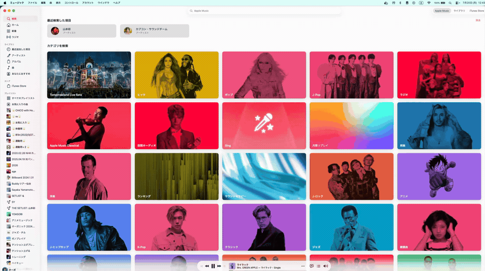

<p align="center">
  
</p>

`amuse` controls Apple Music (Music.app) from the terminal on macOS, via AppleScript.

## Status

Playback control (play/pause/next/prev), now-playing, shuffle/repeat/volume, and an interactive TUI
are implemented. Library browsing, playlists, and search are not — Music.app's AppleScript dictionary
only exposes the local library, and querying/streaming Apple Music's full catalog would need the
separate MusicKit API (not implemented here).

> [!IMPORTANT]
> macOS only. `amuse` controls Music.app via AppleScript (`osascript`), which doesn't exist on
> Linux/Windows.

## Install

```sh
brew install o-ga09/tap/amuse
```

or

```sh
go install github.com/o-ga09/amuse@latest
```

## Usage

```sh
amuse            # launch the interactive TUI
amuse play
amuse pause
amuse next
amuse prev
amuse now        # show the currently playing track

amuse shuffle    # get shuffle state
amuse shuffle on
amuse repeat     # get repeat mode
amuse repeat off|one|all
amuse volume     # get volume
amuse volume 50  # set volume (0-100)
```

TUI keybindings: `space` play/pause, `n` next, `p` prev, `s` toggle shuffle, `c` cycle repeat,
`+`/`-` volume, `r` refresh, `q` quit.

## Troubleshooting

### "This computer is not authorized" when fetching artwork

When the current track is an Apple Music / iTunes Match item and the computer hasn't been
authorized, Music.app raises an authorization dialog instead of returning album artwork:

> このコンピュータは承認されていません。このコンピュータ上で Apple Music や iTunes Match を使用するには、コンピュータを承認する必要があります。
>
> ("This computer is not authorized. To use Apple Music or iTunes Match on this computer, you need
> to authorize the computer.")

Authorize the computer in Music.app: **Account → Authorizations → Authorize This Computer…**
(アカウント → 認証 → このコンピュータを認証), then sign in with your Apple Account.

<p align="center">
  
</p>

> [!NOTE]
> macOS allows a single Apple Account to authorize up to 5 computers. If you're at the limit,
> deauthorize an old computer (or use **Deauthorize All** from a computer signed in to the account)
> before authorizing this one.

## Development

```sh
make build
make test
make lint
```
